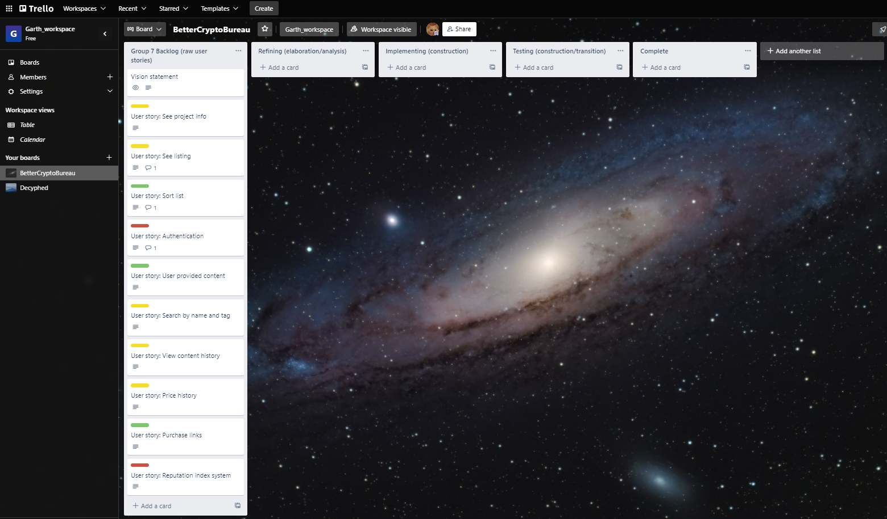

# Inception

## Better Cryptocurrency Bureau App

Current kanban state:

### Vision Statement

For retail investors who need a place to research cryptocurrencies before making investments.

The Better Cryptocurrency Bureau App is a financial information service provider that helps investors find trustworthy cryptocurrencies.

Unlike Coinmarketcap.com, our product actually helps investors determine if a cryptocurrency is a scam or sound project.

### Backlog: User stories

#### User story: See project info

Story points = 2

As an investor, I want to see who project founders are, so that I can easily research their backgrounds and credentials. I'd like to have other information available as well.

#### User story: See listing

Story points = 1

As an explorer, I want to see a list of all documented cryptocurrencies, so that I can explore and find new ones.

#### User story: Sort list

Story points = 2

As an inquisitive investor, I want to sort the cryptocurrency list by reputation, price, and other metrics, so that I can discover new ones.

#### User story: Authentication

Story points = 4

As a security-aware browser, I want to login with a username and password, so that I can feel safe.

#### User story: User provided content

Story points = 2

As an cryptocurrency expert, I want to contribute information to cryptocurrency projects, so that I can improve my reputation.

#### User story: Search by name and tag

Story points = 3

As a user, I want to be able to search for specific cryptocurrency projects by name and tags, so that I can easily find what I'm looking for.

#### User story: View content history

Story points = 3

As an investor suspicious of Wall Street Bets, I want to access historical/archive/vintage information, so that I can see if users are contributing falsified information to pump up a project.

#### User story: Price history

Story points = 3

As a risk averse investor, I want to see price time series, so that I can tell how volatile a cryptocurrency's price is. I'd also like to see price/initial coin offering price, to know how over- or under-valued the coin is, relative to first listing.

#### User story: Purchase links

Story points = 1

As an eager investor, I want links to external coin markets, so that I know I'm going to purchase the correct coin.

#### User story: Reputation index system

Story points = 2

As an easily overwhelmed investor, I want to see a index number/letter system that tells me with a quick glance how reputable a coin is.

