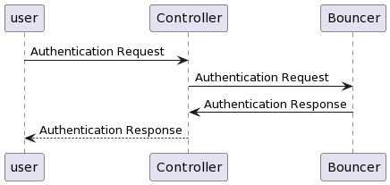

# BetterCryptoBureau


## Elaboration Part 2 - Refine user stories, sequence diagram

*2022.10.25, 100 pts = 25%*

1. Given Elaboration Part 1 classes, create a play/narration/sequence diagram for each user story.

2. When starting a user story, move it to Refining. Max one story/person in Refining. 

3. When play/narration is complete, move user story to Implementing. Attach to the story the narration.

## User story x



```diagram
# //www.plantuml.com/plantuml/png/SoWkIImgAStDuIejJYrIqBLJSCxFAodApyb9BR9IS2mjoKZDAybCJYp9pCzJ24ejB4qjBk7YWgc1w73AByrBngCS8a_OyEA2_BpYL5JJWNfAY_6fTaZDIm4w7m00

@startuml
user -> Controller: Authentication Request

Controller -> Bouncer: Authentication Request
Bouncer -> Controller: Authentication Response

Controller --> user: Authentication Response
@enduml
```

