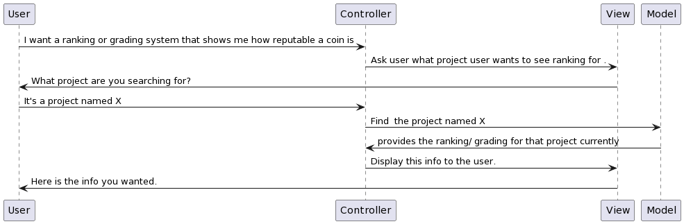

# BetterCryptoBureau

## Elaboration Part 2 - Refine user stories, sequence diagram

*2022.10.25, 100 pts = 25%*

1. Given Elaboration Part 1 classes, create a play/narration/sequence diagram for each user story.

2. When starting a user story, move it to Refining. Max one story/person in Refining. 

3. When play/narration is complete, move user story to Implementing. Attach to the story the narration.

| CLASS NAME    | FUNCTION                                                     |
| ------------- | ------------------------------------------------------------ |
| Controller    | Controller from MVC architectural pattern. Receives and directs user requests. |
| Model         | Persistent storage, performing database storage and operations (sort lists). |
| View          | Display data to users (View from MVC).                       |
| Authenticator | Security, for user authentication.                           |
| Calculator    | Performs calculations, such as calculate cryptocurrency reputation. |
| Presenter     | Get list of available cryptocurrencies, get their historical data, get project information, search for cryptocurrencies, purchase links, reputation score. |

### Current kanban state


## User stories

Images created at https://www.plantuml.com/plantuml/uml/

### Authentication

Story points = 4

*As a security-aware browser, I want to login with a username and password, so that I can feel safe.*

**Following is sourced/adapted from Michael Dorin's user story 8:**

```diagram
@startuml
User -> Controller: I would like to contribute content
Controller -> View: Tell User to Log In
View -> User: You need to log in
User -> Controller: Here is my login information
Controller -> Authenticator: Is this login valid?
Authenticator -> Controller: Yes
Controller -> View: Display main menu
View -> User: Here is the main menu
@enduml
```


### See project info

Story points = 2

*As an investor, I want to see who project founders are, so that I can easily research their backgrounds and credentials.*

```diagram
@startuml
User -> Controller: I would like to see project info.
Controller -> View: Ask user what project they want to see info about.
View -> User: What project are you interested in?
User -> Controller: Project X.
Controller -> Model: Find us info on project X.
Model -> Controller: Here is the info.
Controller -> View: Display this info to the user.
View -> User: Here is the info you wanted.
@enduml
```


Here is an updated generalization of the above:


### See listing

Story points = 1

*As an explorer, I want to see a list of all documented cryptocurrencies, so that I can explore and find new ones.*

```diagram
@startuml
User -> Controller: I would like to see a a listing of all projects.
Controller -> Model: Find us a listing of all projects.
Model -> Controller: Here is the info.
Controller -> View: Display this info to the user.
View -> User: Here is the info you wanted.
@enduml
```


### Sort list

Story points = 2

*As an inquisitive investor, I want to sort the cryptocurrency list by reputation, price, and other metrics, so that I can discover new ones.*

```diagram
@startuml
User -> Controller: I would like to sort the list of projects by a specific field.
Controller -> View: Ask user what they want to order by.
View -> User: What do you what to order this list by?
User -> Controller: Reputation score.
Controller -> Model: Order the projects by Reputation score.
Model -> Controller: Here is the info.
Controller -> View: Display this info to the user.
View -> User: Here is the info you wanted.
@enduml
```


### User provided content

Story points = 4

*As an cryptocurrency expert, I want to contribute information to cryptocurrency projects, so that I can improve my reputation.*

```diagram
@startuml
User -> Controller: I would like to submit info about a project, so that I can earn xp points.
Controller -> View: Ask user what project they want to contribute info about.
View -> User: What project do you want to contribute info about?
User -> Controller: Project X.
Controller -> View: Ask user what category of info they want to contribute.
View -> User: What category of info do you want to contribute?
User -> Controller: Blockchain info.
Controller -> View: Ask user what specific blockchain info they want to contribute.
View -> User: What specific blockchain info do you want to contribute?
User -> Controller: This project runs on the Ethereum blockchain.
Controller -> Model: Store this user provided information.
Controller -> Calculator: Give the user 10 XP points for contributing info about blockchain.
Controller -> View: Tell the user we have saved the info and awarded them 10 XP.
View -> User: We have saved the info and awarded you 10 XP.
@enduml
```


### Search by name and tag

Story points = 3

*As a user, I want to be able to search for specific cryptocurrency projects by name and tags, so that I can easily find what I'm looking for.*

```diagram
@startuml
User -> Controller: I want to search for a project I've heard about.
Controller -> View: Ask user what project they want to search for.
View -> User: What project are you searching for?
User -> Controller: It's a project that runs on Ethereum blockchain and starts with "tulip".
Controller -> Model: Find us all projects that run on Ethereum blockchain and start with tulip.
Model -> Controller: Here is the info.
Controller -> View: Display this info to the user.
View -> User: Here is the info you wanted.
@enduml
```


### View content history

Story points = 3

*As an investor suspicious of Wall Street Bets, I want to access historical/archive/vintage information, so that I can see if users are contributing falsified information to pump up a project.*

```diagram
@startuml
User -> Controller: I want to search a project historical data like price and overall perfomance .
Controller -> View: Ask user what project user wants to see .
View -> User: What project are you searching for?
User -> Controller: It's a project named vechain 
Controller -> Model: Find  the project named vechain 
Model -> Controller: Here is the info of the requested project.
Controller -> View: Display this info to the user.
View -> User: Here is the info you wanted.
@enduml
```


### Price history

Story points = 3

*As a risk averse investor, I want to see price time series, so that I can tell how volatile a cryptocurrency's price is. I'd also like to see price/initial coin offering price, to know how over- or under-valued the coin is, relative to first listing.*

```diagram
@startuml
User -> Controller:  I want to see  performance of a project so I can  get better picture of its volatility and overall performance in relation to the overall market.
Controller -> View: Ask user what project user wants to see .
View -> User: What project are you searching for?
User -> Controller: It's a project named X
Controller -> Model: Find  the project named X 
Model -> Controller: Here is the info of the requested project.
Controller -> View: Display this info to the user.
View -> User: Here is the info you wanted.
User -> Controller :Can you rate this project price flactuation compared to overall market
Model -> Controller: Here is the info of the requested project.
@enduml
```


### Purchase links

Story points = 1

*As an eager investor, I want links to external coin markets, so that I know I'm going to purchase the correct coin.*

```diagram
@startuml
User -> Controller: I want to see the list of exchanges I can purchase cryptocurrency coins/shares 
Controller -> View: Ask user what project user wants to see .
View -> User: What project are you searching for?
User -> Controller: It's a project named X
Controller -> Model: Find  the project named X 
Model -> Controller: Here is the list of exchanges you can purchase project X
Controller -> View: Display this info to the user.
View -> User: Here is the info you wanted.
@enduml
```


### Reputation index system

Story points = 2

*As an easily overwhelmed investor, I want to see a index number/letter system that tells me with a quick glance how reputable a coin is.*

```diagram
@startuml
User -> Controller: I want a ranking or grading system that shows me how reputable a coin is 
Controller -> View: Ask user what project user wants to see ranking for .
View -> User: What project are you searching for?
User -> Controller: It's a project named X
Controller -> Model: Find  the project named X 
Model -> Controller: provides the ranking/ grading for that project currently 
Controller -> View: Display this info to the user.
View -> User: Here is the info you wanted.
@enduml
```



