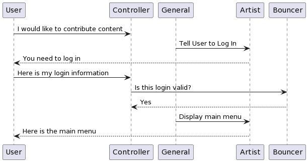
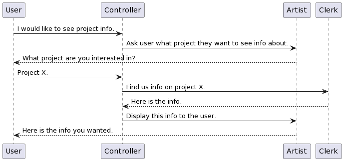
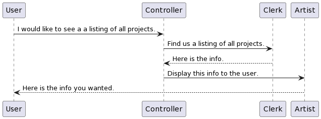
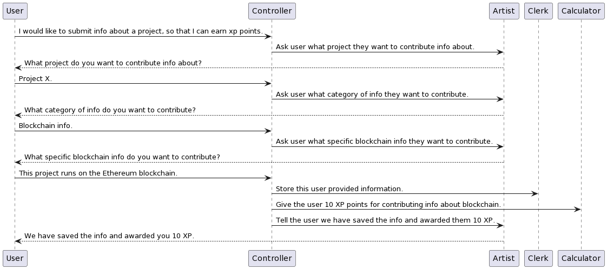
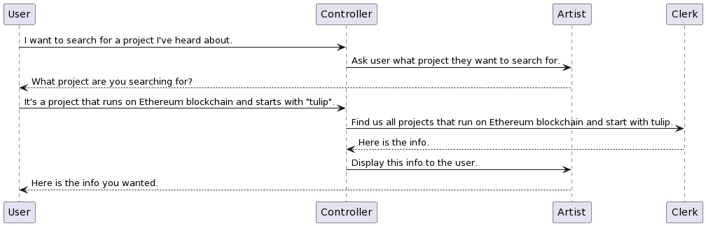

# BetterCryptoBureau

## Implementation - UML and code it

*2022.12.06, 100 pts = 25%*

For each refined story in Implementing:

1. Draw a rough uml diagram per narration.

2. Code the UML

3. Push to Github.

In Kanban, attach to each user story the UML diagram.

Once code is complete, move user story to Testing.

## Sequence diagram to UML

Images created at https://www.plantuml.com/plantuml/uml/

### Authentication

Story points = 4

*As a security-aware browser, I want to login with a username and password, so that I can feel safe.*

#### Sequence diagram

```diagram
@startuml
User -> Controller: I would like to contribute content
General -> Artist: Tell User to Log In
Artist --> User: You need to log in
User -> Controller: Here is my login information
Controller -> Bouncer: Is this login valid?
Bouncer --> Controller: Yes
General -> Artist: Display main menu
Artist --> User: Here is the main menu
@enduml
```



#### UML diagram

place diagram here

### See project info

Story points = 2

*As an investor, I want to see who project founders are, so that I can easily research their backgrounds and credentials.*

#### Sequence diagram

```diagram
@startuml
User -> Controller: I would like to see project info.
Controller -> Artist: Ask user what project they want to see info about.
Artist --> User: What project are you interested in?
User -> Controller: Project X.
Controller -> Clerk: Find us info on project X.
Clerk --> Controller: Here is the info.
Controller -> Artist: Display this info to the user.
Artist --> User: Here is the info you wanted.
@enduml
```



#### UML diagram

place diagram here

### See listing

Story points = 1

*As an explorer, I want to see a list of all documented cryptocurrencies, so that I can explore and find new ones.*

#### Sequence diagram

```diagram
@startuml
User -> Controller: I would like to see a a listing of all projects.
Controller -> Clerk: Find us a listing of all projects.
Clerk --> Controller: Here is the info.
Controller -> Artist: Display this info to the user.
Artist --> User: Here is the info you wanted.
@enduml
```



#### UML diagram

place diagram here

### Sort list

Story points = 2

*As an inquisitive investor, I want to sort the cryptocurrency list by reputation, price, and other metrics, so that I can discover new ones.*

#### Sequence diagram

```diagram
@startuml
User -> Controller: I would like to sort the list of projects by a specific field.
Controller -> Artist: Ask user what they want to order by.
Artist --> User: What do you what to order this list by?
User -> Controller: Reputation score.
Controller -> Clerk: Order the projects by Reputation score.
Clerk --> Controller: Here is the info.
Controller -> Artist: Display this info to the user.
Artist --> User: Here is the info you wanted.
@enduml
```


#### UML diagram

place diagram here

### User provided content

Story points = 4

*As an cryptocurrency expert, I want to contribute information to cryptocurrency projects, so that I can improve my reputation.*

#### Sequence diagram

```diagram
@startuml
User -> Controller: I would like to submit info about a project, so that I can earn xp points.
Controller -> Artist: Ask user what project they want to contribute info about.
Artist --> User: What project do you want to contribute info about?
User -> Controller: Project X.
Controller -> Artist: Ask user what category of info they want to contribute.
Artist --> User: What category of info do you want to contribute?
User -> Controller: Blockchain info.
Controller -> Artist: Ask user what specific blockchain info they want to contribute.
Artist --> User: What specific blockchain info do you want to contribute?
User -> Controller: This project runs on the Ethereum blockchain.
Controller -> Clerk: Store this user provided information.
Controller -> Calculator: Give the user 10 XP points for contributing info about blockchain.
Controller -> Artist: Tell the user we have saved the info and awarded them 10 XP.
Artist --> User: We have saved the info and awarded you 10 XP.
@enduml
```



#### UML diagram

place diagram here

### Search by name and tag

Story points = 3

*As a user, I want to be able to search for specific cryptocurrency projects by name and tags, so that I can easily find what I'm looking for.*

#### Sequence diagram

```diagram
@startuml
User -> Controller: I want to search for a project I've heard about.
Controller -> Artist: Ask user what project they want to search for.
Artist --> User: What project are you searching for?
User -> Controller: It's a project that runs on Ethereum blockchain and starts with "tulip".
Controller -> Clerk: Find us all projects that run on Ethereum blockchain and start with tulip.
Clerk --> Controller: Here is the info.
Controller -> Artist: Display this info to the user.
Artist --> User: Here is the info you wanted.
@enduml
```



#### UML diagram

place diagram here

### View content history

Story points = 3

*As an investor suspicious of Wall Street Bets, I want to access historical/archive/vintage information, so that I can see if users are contributing falsified information to pump up a project.*

#### Sequence diagram

```diagram
@startuml
User -> Controller: 
Controller -> 
...
@enduml
```


#### UML diagram

place diagram here

### Price history

Story points = 3

*As a risk averse investor, I want to see price time series, so that I can tell how volatile a cryptocurrency's price is. I'd also like to see price/initial coin offering price, to know how over- or under-valued the coin is, relative to first listing.*

#### Sequence diagram

```diagram
@startuml
User -> Controller: 
Controller -> 
...
@enduml
```


#### UML diagram

place diagram here

### Purchase links

Story points = 1

*As an eager investor, I want links to external coin markets, so that I know I'm going to purchase the correct coin.*

#### Sequence diagram

```diagram
@startuml
User -> Controller: 
Controller -> 
...
@enduml
```


#### UML diagram

place diagram here

### Reputation index system

Story points = 2

*As an easily overwhelmed investor, I want to see a index number/letter system that tells me with a quick glance how reputable a coin is.*

#### Sequence diagram

```diagram
@startuml
User -> Controller: 
Controller -> 
...
@enduml
```


