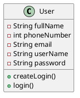
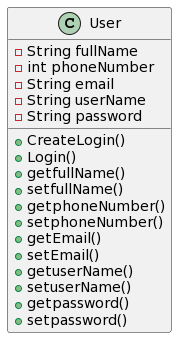
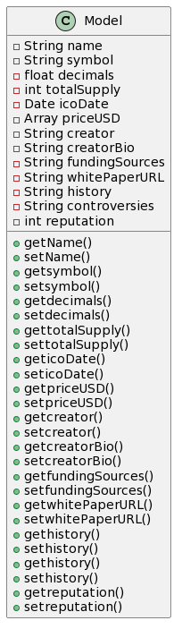
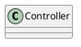
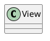

# BetterCryptoBureau

## Implementation - UML and code it

*2022.12.06, 100 pts = 25%*

For each refined story in Implementing:

1. Draw a rough UML diagram per narration.

2. Code the UML

3. Push to Github.

In Kanban, attach to each user story the UML diagram.

Once code is complete, move user story to Testing.

### Current kanban state

## Sequence diagram to UML

Images created at https://www.plantuml.com/plantuml/uml/

## UML

### User

User class:

### Model

Model view:

### Controller

Controller is just a router. These modules tend to be very short. Wouldn't they just be methods?

### View

Template Engines create these dynamic websites, so do they even have code associated to them?

