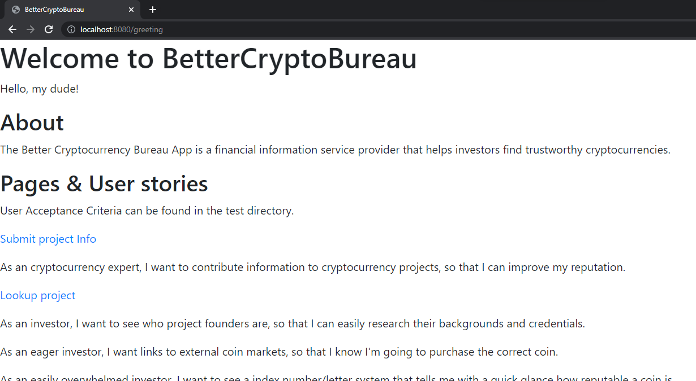
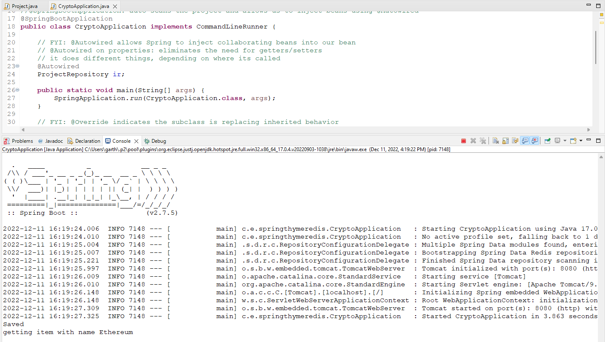
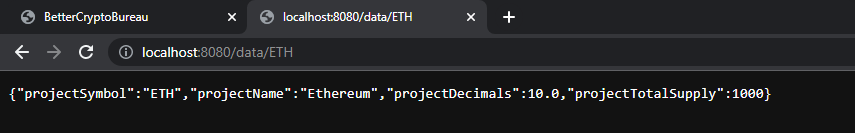
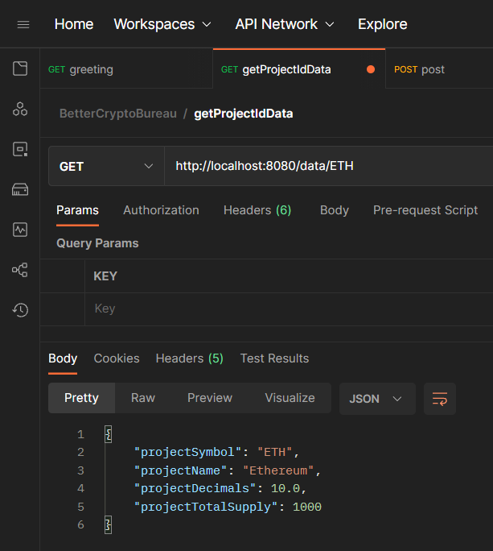
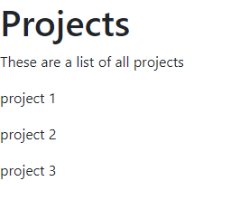
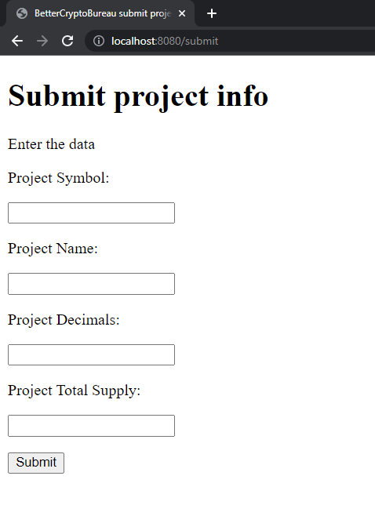
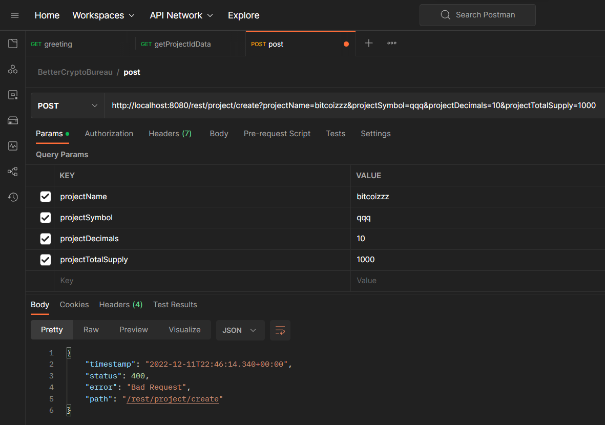
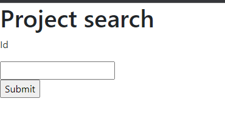
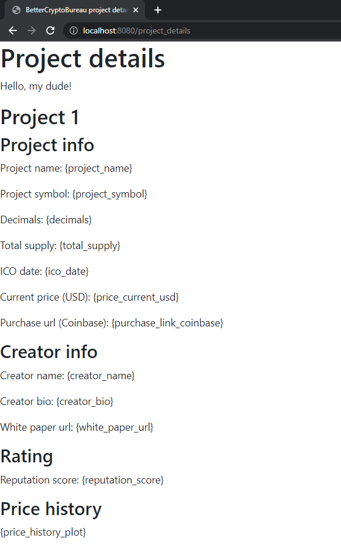

# BetterCryptoBureau

## Test - write, perform, screenshot tests

2022.12.07, 100 pts = 25%

1. Define the tools required to test the requirement.

   The tools to test functionality include Eclipse, Chrome and [Postman](https://www.postman.com/).

2. Perform the steps.

3. Screenshot the properly working code and unit test execution results.

   No j-unit testing was done.

4. Attach to each complete user story these screenshots.

5. Attach to each complete user story the j-unit test execution results.

   No j-unit testing was done.

6. Move user story to Done.

### User Stories and Acceptance Criteria

#### 1. Base functionality

As a user, I want the application to launch and write to database.

1. To test this, launch Eclipse IDE and run application.

   Frontend:

   ```html
   <!DOCTYPE HTML>
   <html xmlns:th="http://www.thymeleaf.org">
   <HTML>
   <HEAD>
     <TITLE>BetterCryptoBureau</TITLE>
     <meta http-equiv="Content-Type" content="text/html; charset=UTF-8" />
     <link rel="stylesheet"
       href="https://stackpath.bootstrapcdn.com/bootstrap/4.1.3/css/bootstrap.min.css"
       integrity="sha384-MCw98/SFnGE8fJT3GXwEOngsV7Zt27NXFoaoApmYm81iuXoPkFOJwJ8ERdknLPMO"
       crossorigin="anonymous">
   </HEAD>
   <BODY>
     <h1>Welcome to BetterCryptoBureau</h1>
     <p th:text="'Hello, ' + ${name} + '!'"/>
     <h2>About</h2>
     <p>The Better Cryptocurrency Bureau App is a financial information service provider that helps investors find trustworthy cryptocurrencies.</p>
   
     <h2>Pages & User stories</h2>
     <p>User Acceptance Criteria can be found in the test directory.</p>
     
     <p><a href="/submit">Submit project Info</a></p>
     <p>As an cryptocurrency expert, I want to contribute information to cryptocurrency projects, so that I can improve my reputation.</p>
   
     <p><a href="/project_details">Lookup project</a></p>
     <p>As an investor, I want to see who project founders are, so that I can easily research their backgrounds and credentials.</p>
     <p>As an eager investor, I want links to external coin markets, so that I know I'm going to purchase the correct coin.</p>
     <p>As an easily overwhelmed investor, I want to see a index number/letter system that tells me with a quick glance how reputable a coin is.</p>
     <p>As a risk averse investor, I want to see price time series, so that I can tell how volatile a cryptocurrency's price is. I'd also like to see price/initial coin offering price, to know how over- or under-valued the coin is, relative to first listing.</p>
   
     <p><a href="/project_list">View project listing</a></p>
     <p>As an explorer, I want to see a list of all documented cryptocurrencies, so that I can explore and find new ones.</p>
     <p>As an inquisitive investor, I want to sort the cryptocurrency list by reputation, price, and other metrics, so that I can discover new ones.</p>
     
     <p><a href="/project_search">Search for a project</a></p>
     <p>As a user, I want to be able to search for specific cryptocurrency projects by name and tags, so that I can easily find what I'm looking for.</p>
       
     <p><a href="/history">View project information history</a></p>
     <p>As an investor suspicious of Wall Street Bets, I want to access historical/archive/vintage information, so that I can see if users are contributing falsified information to pump up a project.</p>
       
     <p><a href="/login">Log in</a></p> 
     <p>As a security-aware browser, I want to login with a username and password, so that I can feel safe.</p> 
   </BODY>
   </HTML>
   ```

   Screenshot:

   

   ```text
     .   ____          _            __ _ _
    /\\ / ___'_ __ _ _(_)_ __  __ _ \ \ \ \
   ( ( )\___ | '_ | '_| | '_ \/ _` | \ \ \ \
    \\/  ___)| |_)| | | | | || (_| |  ) ) ) )
     '  |____| .__|_| |_|_| |_\__, | / / / /
    =========|_|==============|___/=/_/_/_/
    :: Spring Boot ::                (v2.7.5)
   
   2022-12-11 16:19:24.006  INFO 7148 --- [           main] c.e.springthymeredis.CryptoApplication   : Starting CryptoApplication using Java 17.0.4.1 on Azteca200 with PID 7148 (C:\Users\garth\eclipse-workspace\CryptoBureau\target\classes started by garth in C:\Users\garth\eclipse-workspace\CryptoBureau)
   2022-12-11 16:19:24.010  INFO 7148 --- [           main] c.e.springthymeredis.CryptoApplication   : No active profile set, falling back to 1 default profile: "default"
   2022-12-11 16:19:25.004  INFO 7148 --- [           main] .s.d.r.c.RepositoryConfigurationDelegate : Multiple Spring Data modules found, entering strict repository configuration mode
   2022-12-11 16:19:25.007  INFO 7148 --- [           main] .s.d.r.c.RepositoryConfigurationDelegate : Bootstrapping Spring Data Redis repositories in DEFAULT mode.
   2022-12-11 16:19:25.221  INFO 7148 --- [           main] .s.d.r.c.RepositoryConfigurationDelegate : Finished Spring Data repository scanning in 196 ms. Found 1 Redis repository interfaces.
   2022-12-11 16:19:25.997  INFO 7148 --- [           main] o.s.b.w.embedded.tomcat.TomcatWebServer  : Tomcat initialized with port(s): 8080 (http)
   2022-12-11 16:19:26.009  INFO 7148 --- [           main] o.apache.catalina.core.StandardService   : Starting service [Tomcat]
   2022-12-11 16:19:26.010  INFO 7148 --- [           main] org.apache.catalina.core.StandardEngine  : Starting Servlet engine: [Apache Tomcat/9.0.68]
   2022-12-11 16:19:26.148  INFO 7148 --- [           main] o.a.c.c.C.[Tomcat].[localhost].[/]       : Initializing Spring embedded WebApplicationContext
   2022-12-11 16:19:26.148  INFO 7148 --- [           main] w.s.c.ServletWebServerApplicationContext : Root WebApplicationContext: initialization completed in 2072 ms
   2022-12-11 16:19:27.309  INFO 7148 --- [           main] o.s.b.w.embedded.tomcat.TomcatWebServer  : Tomcat started on port(s): 8080 (http) with context path ''
   2022-12-11 16:19:27.325  INFO 7148 --- [           main] c.e.springthymeredis.CryptoApplication   : Started CryptoApplication in 3.863 seconds (JVM running for 4.474)
   Saved
   getting item with name Ethereum
   ```

   

##### Status: Complete. Frontend and backend design complete.

#### 2. Login

##### User story

As a security-aware browser, I want to login with a username and password, so that I can feel safe.

##### Acceptance criteria 

It's done when I can enter a username and password, click a login button, and am routed to a new page.

##### Status: Incomplete. Existing frontend design is complete.

TODO: screenshot of login page

#### 3. Lookup

##### User story

As an investor, I want to see who project founders are, so that I can easily research their backgrounds and credentials.

#####  Acceptance criteria 

It's done when I can click on a project, routed to the project's page, and see basic project info such as the project founder's full name.


##### Status: REST API GET requests working, but no frontend.

Frontend:

```html
<!DOCTYPE HTML>
<html xmlns:th="http://www.thymeleaf.org">
<HTML>
<HEAD>
  <TITLE>BetterCryptoBureau search</TITLE>
  <meta http-equiv="Content-Type" content="text/html; charset=UTF-8" />
  <link rel="stylesheet"
    href="https://stackpath.bootstrapcdn.com/bootstrap/4.1.3/css/bootstrap.min.css"
    integrity="sha384-MCw98/SFnGE8fJT3GXwEOngsV7Zt27NXFoaoApmYm81iuXoPkFOJwJ8ERdknLPMO"
    crossorigin="anonymous">
</HEAD>
<BODY>
<form action="/data" method="get">
  <h1>Project search</h1>
  <!-- the following are source from Model Project.java -->
  <p>Id</p>
  <INPUT TYPE="text" NAME="projectId" VALUE=""><P>
  <input type="submit" value="Submit">
<!--   <p>Name</p> -->
<!--   <INPUT TYPE="text" NAME="projectName" VALUE=""><P> -->
<!--   <p>Symbol</p> -->
<!--   <INPUT TYPE="text" NAME="projectSymbol" VALUE=""><P> -->
</form>
</BODY>
</HTML>
```

Backend:

```java
@GetMapping(value = "/data/{projectSymbol}")
public Project getItemIdData(@PathVariable String projectSymbol) {  // http://localhost:8080/data/id1 = object oriented, built by system. this is the RESTful way, where everything is an object
    // public Project getProjectIdData(@RequestParam("projectId") String projectId) {  // http://localhost:8080/data/id1?projectId=id1 = user centric, built by user
    Project iget = null;
    System.out.println("getting project with symbol "+projectSymbol);
    try {
        iget = ir.findById(projectSymbol).get();
    } catch (Exception e) {
        System.out.println("Not found xxx");
    }
    return iget;
}
```





#### 4. View listing

##### User story

As an explorer, I want to see a list of all documented cryptocurrencies, so that I can explore and find new ones.

##### Acceptance criteria 
It's done when the Project List page displays a list of all projects.

##### Status: Incomplete.

Frontend:

```html
<!DOCTYPE HTML>
<html xmlns:th="http://www.thymeleaf.org">
<HTML>
<HEAD>
  <TITLE>BetterCryptoBureau project list</TITLE>
  <meta http-equiv="Content-Type" content="text/html; charset=UTF-8" />
  <link rel="stylesheet"
    href="https://stackpath.bootstrapcdn.com/bootstrap/4.1.3/css/bootstrap.min.css"
    integrity="sha384-MCw98/SFnGE8fJT3GXwEOngsV7Zt27NXFoaoApmYm81iuXoPkFOJwJ8ERdknLPMO"
    crossorigin="anonymous">
</HEAD>
<BODY>
  <h1>Projects</h1>
  <p>These are a list of all projects</p>
  <p>project 1</p>
  <p>project 2</p>
  <p>project 3</p>
</BODY>
</HTML>
```



#### 5. View listing sorted

##### User story

As an inquisitive investor, I want to sort the cryptocurrency list by reputation, price, and other metrics, so that I can discover new ones.

##### Acceptance criteria 

It's done when a table is sortable by a column.

It's done when column 1 is Project Name and column 2 is Reputation.

##### Status: Incomplete

#### 6. Submit info

##### User story

As an cryptocurrency expert, I want to contribute information to cryptocurrency projects, so that I can improve my reputation.


##### Acceptance criteria 
It's done when I can submit a REST POST request which contains some basic project info.

##### Status: Incomplete. Frontend form exists with proper input types, but backend POST functionality not working.

Frontend:

```html
<!DOCTYPE HTML>
<html xmlns:th="http://www.thymeleaf.org">
<HTML>
<HEAD>
  <TITLE>BetterCryptoBureau project details</TITLE>
  <meta http-equiv="Content-Type" content="text/html; charset=UTF-8" />
  <link rel="stylesheet"
    href="https://stackpath.bootstrapcdn.com/bootstrap/4.1.3/css/bootstrap.min.css"
    integrity="sha384-MCw98/SFnGE8fJT3GXwEOngsV7Zt27NXFoaoApmYm81iuXoPkFOJwJ8ERdknLPMO"
    crossorigin="anonymous">
</HEAD>
<BODY>
  <h1>Project details</h1>
  <p th:text="'Hello, ' + ${name} + '!'"/>
  <h2>Project 1</h2>
  <h3>Project info</h3>
  <p>Project name: {project_name}</p>
  <p>Project symbol: {project_symbol}</p>
  <p>Decimals: {decimals}</p>
  <p>Total supply: {total_supply}</p>
  <p>ICO date: {ico_date}</p>
  <p>Current price (USD): {price_current_usd}</p>
  <p>Purchase url (Coinbase): {purchase_link_coinbase}</p>

  <h3>Creator info</h3>
  <p>Creator name: {creator_name}</p>
  <p>Creator bio: {creator_bio}</p>
  <p>White paper url: {white_paper_url}</p>

  <h3>Rating</h3>
  <p>Reputation score: {reputation_score}</p>

  <h3>Price history</h3>
  <p>{price_history_plot}</p>
</BODY>
</HTML>
```



Backend:

```java
// FYI: @PostMapping maps HTTP POST requests to a specific handler method
// http://localhost:8080/rest/project/create?projectId=id3&projectName=bitcoin&projectSymbol=btc&projectDecimals=10&projectTotalSupply=1000
@PostMapping(value = "/rest/project/create", consumes= {"*/*"} )
public Project createProject(@RequestBody Project project) {  // http://localhost:8080/data/id1 this is the RESTful way
    System.out.println(project.toString());
    ir.save(project);
    return project;
}
```



#### 7. Search

##### User story

As a user, I want to search for specific cryptocurrency projects by name and tags, so that I can easily find what I'm looking for.


##### Acceptance criteria 

It's done when I can type into a field a project name, click a search button, and am routed to a Results page containing that project's info.

##### Status: Incomplete frontend. REST API GET requests working.


Frontend:

```html
<!DOCTYPE HTML>
<html xmlns:th="http://www.thymeleaf.org">
<HTML>
<HEAD>
  <TITLE>BetterCryptoBureau search</TITLE>
  <meta http-equiv="Content-Type" content="text/html; charset=UTF-8" />
  <link rel="stylesheet"
    href="https://stackpath.bootstrapcdn.com/bootstrap/4.1.3/css/bootstrap.min.css"
    integrity="sha384-MCw98/SFnGE8fJT3GXwEOngsV7Zt27NXFoaoApmYm81iuXoPkFOJwJ8ERdknLPMO"
    crossorigin="anonymous">
</HEAD>
<BODY>
<form action="/data" method="get">
  <h1>Project search</h1>
  <!-- the following are source from Model Project.java -->  
  <p>Id</p>
  <INPUT TYPE="text" NAME="projectId" VALUE=""><P>
  <input type="submit" value="Submit">
</form>
</BODY>
</HTML>
```



#### 8. History

##### User story

As an investor suspicious of Wall Street Bets, I want to access historical/archive/vintage information, so that I can see if users are contributing falsified information to pump up a project.

##### Acceptance criteria 

It's done when I can view historical information about a project.

It's done when a database table contains fields project_name, founder_name, current. Looking at history shows now just the single row flagged as current, but all other rows as well.

##### Status: Incomplete

#### 9. Price series

##### User story

As a risk averse investor, I want to see price time series, so that I can tell how volatile a cryptocurrency's price is. I'd also like to see price/initial coin offering price, to know how over- or under-valued the coin is, relative to first listing.

##### Acceptance criteria 

It's done when a project page displays latest price divided by initial coin offering price in USD.

It's done when the page displays a price series where column 1 is dates and column 2 is price in USD.

##### Status: Incomplete. Thymeleaf template engine not rendering dynamic page.



#### 10. Purchase links

##### User story

As an eager investor, I want links to external coin markets, so that I know I'm going to purchase the correct coin.

##### Acceptance criteria 

It's done when each project page contains a link to its page on www.coinbase.com, where I can navigate to buy it.

##### Status: Incomplete. While placeholder exists in HTML template, feature not added to model due to low priority.

#### 11. Reputation

##### User story

As an easily overwhelmed investor, I want to see a index number/letter system that tells me with a quick glance how reputable a coin is.

##### Acceptance criteria 

It's done when I can see a single metric score that tells me how reputable a project is. This score should be determined using an arbitrary calculation.

##### Status: Incomplete. While placeholder exists in HTML template, feature not added to model due to low priority.
